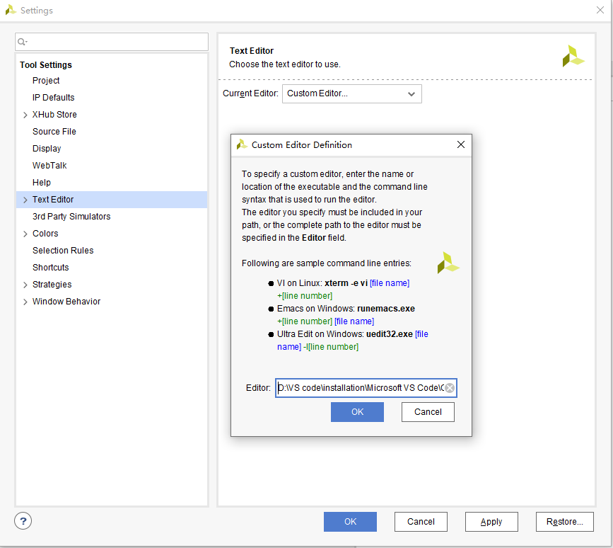
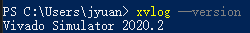

# vscode配置Verilog环境（Vivado+vscode）

## 替换Vivado默认文本编辑器

依次点击 Tools -> Settings -> Text Editor，键入<desired editor absolute path> [file name] -[line number]

## 在VSCode中安装相关 插件

首先安装verilog扩展。为使在vscode中编辑代码时有自动检错功能，在环境变量中添加vivado安装路径下的bin文件夹。添加完成之后，在命令行输入 `xvlog –version` 检测是否生效

最后找到刚才安装的verilog扩展设置，将verilog的Linter更换成xvlog。