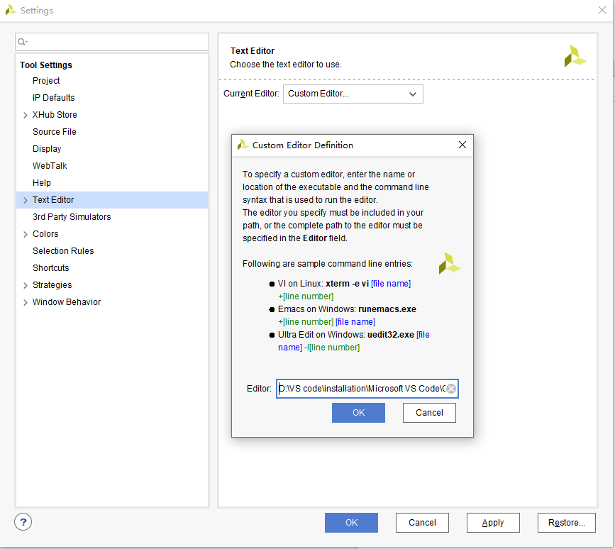

# vscode配置Verilog环境（Vivado+vscode）

## 替换Vivado默认文本编辑器

依次点击 Tools -> Settings -> Text Editor，键入<desired editor absolute path> [file name] -[line number]



## 在VSCode中安装相关 插件

首先安装verilog扩展。为使在vscode中编辑代码时有自动检错功能，在环境变量中添加vivado安装路径下的bin文件夹。添加完成之后，在命令行输入 `xvlog –version` 检测是否生效


最后找到刚才安装的verilog扩展设置，将verilog的Linter更换成xvlog。

# 命令行启动 Vivado

```tcl
vivado -mode <args>		# invocation mode, allowed values are 'gui', 'tcl', and 'batch'

vivado -help	# get information about vivado related commands
```

# Vivado Tcl script

Most actions run in the Vivado IDE result in a Tcl command being executed. The Tcl commands appear in the Vivado IDE Tcl Console and are also captured in the `vivado.jou` and `vivado.log` files. The `vivado.jou` file contains just the commands, and the `vivado.log` file contains both commands and any returned messages.

## Select the top level module

```tcl
# Syntax
set_property top <module_name> [current_fileset]
set_property top_file {<top_file_location>} [current_fileset]
 
# Example
set_property top wave_gen [current_fileset]
set_property top_file {C:\projects\Lab5\LAB5\LAB5.srcs\sources_1\imports\ISE_project\wave_gen.v} [current_fileset]
```

## Elaborate design

```tcl
# Descripttion
# Synthesize a design using Vivado Synthesis and open that design

# Syntax
synth_design -rtl -name <project_name>

# Example
synth_design -rtl -name rtl_1
```

## Create project

```tcl
# Description:
# Create a new project

# Syntax:
create_project  [-part <arg>] [-force] [-in_memory] [-ip] [-rtl_kernel]
                [-quiet] [-verbose] [<name>] [<dir>]

# Usage:
  Name           Description
  --------------------------
  [-part]        Target part
  [-force]       Overwrite existing project directory
  [<name>]       Project name
  [<dir>]        Directory where the project file is saved
                 Default: .
```

# XDC语法

## 普通IO口

```tcl
# 管脚约束
set_property PACKAGE_PIN "引脚编号" [get_ports “端口名称”] 

# 电平信号约束
set_property IOSTANDARD "电平标准" [get_ports “端口名称”]

# Examples 端口名称是数组的话用{ }包括起来
set_property IOSTANDARD LVCMOS33 [get_ports {led[3]}]
set_property IOSTANDARD LVCMOS33 [get_ports {led[2]}]
set_property IOSTANDARD LVCMOS33 [get_ports {led[1]}]
set_property IOSTANDARD LVCMOS33 [get_ports {led[0]}]
set_property PACKAGE_PIN J16 [get_ports {led[3]}]
set_property PACKAGE_PIN K16 [get_ports {led[2]}]
set_property PACKAGE_PIN M15 [get_ports {led[1]}]
set_property PACKAGE_PIN M14 [get_ports {led[0]}]
set_property SLEW SLOW [get_ports {led[3]}]
set_property SLEW SLOW [get_ports {led[2]}]
set_property SLEW SLOW [get_ports {led[1]}]
set_property SLEW SLOW [get_ports {led[0]}]
set_property PACKAGE_PIN N15 [get_ports rst_n]
set_property PACKAGE_PIN U18 [get_ports sys_clk]
set_property IOSTANDARD LVCMOS33 [get_ports rst_n]
set_property IOSTANDARD LVCMOS33 [get_ports sys_clk]
```

